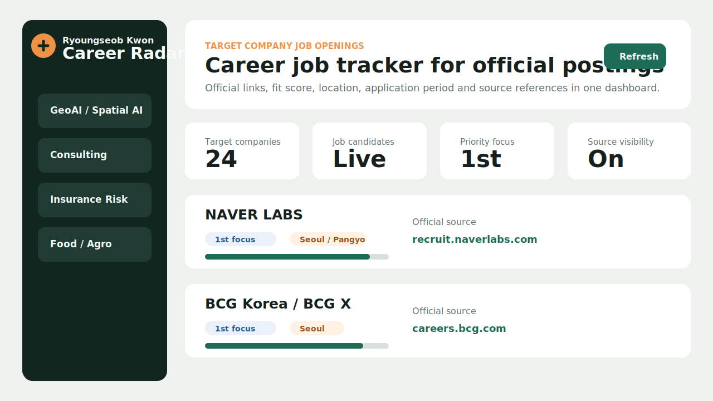

<div align="center">

# Career Radar

최신 CV와 포트폴리오를 기준으로 정리한 타겟 기업 전략 및 공식 채용공고 추적 대시보드

[](https://github.com/twinsben94/Job_Search/actions/workflows/pages.yml)

<a href="https://twinsben94.github.io/Job_Search/"><b>Open Web App</b></a>
&nbsp;&nbsp;|&nbsp;&nbsp;
<a href="./00_Strategy/00_target_companies.txt"><b>Target Strategy</b></a>
&nbsp;&nbsp;|&nbsp;&nbsp;
<a href="./00_Strategy/03_official_recruit_links.txt"><b>Official Links</b></a>

<br><br>

<a href="https://twinsben94.github.io/Job_Search/">
  
</a>

</div>

## What This Does

Career Radar는 지원 타겟 기업을 폴더 기준 순서대로 보여주고, 각 기업의 공식 채용 사이트, 직무 적합도, 추천 직무, 근무지역, 지원 기간 후보, 원문 확인 링크를 한 화면에 정리합니다.

GitHub Pages 공개 URL:

```text
https://twinsben94.github.io/Job_Search/
```

## Dashboard Features

| Feature | Description |
| --- | --- |
| 타겟 기업 순서 | 현재 정리된 `01_Target_Companies` 폴더 순서를 앱에 반영 |
| 공식 채용 링크 | 기업별 공식 채용 사이트와 HTTP 조회 상태 표시 |
| 직무 적합도 | 최신 CV/포트폴리오 기반 fit score와 추천 직무 표시 |
| 채용 스냅샷 | GitHub Actions가 주기적으로 공식 링크를 조회해 스냅샷 갱신 |
| 직접 검증 | 각 카드에서 참고한 공식 링크와 원문 보기 링크 제공 |

## Repository Map

| Folder | Purpose |
| --- | --- |
| `00_Strategy` | 타겟 기업, 지원 전략, 공식 채용 링크 문서 |
| `01_Target_Companies` | 트랙별 기업 폴더와 기업별 지원 정보 |
| `02_Web_App` | Career Radar 웹 앱 소스 코드와 데이터 |
| `docs` | GitHub Pages 배포용 정적 파일 |
| `.github/workflows` | 채용 스냅샷 갱신 및 Pages 배포 자동화 |

## Local Run

`index.html`을 더블클릭하면 브라우저 보안 정책 때문에 JSON 데이터 로딩이 막힐 수 있습니다. 로컬에서는 서버로 실행하세요.

```powershell
cd "C:\Users\twins\OneDrive\바탕 화면\Ryoungseob\결혼 및 취준\02_Career\02_Web_App"
npm start
```

브라우저에서 엽니다.

```text
http://127.0.0.1:4173
```

## Deployment

현재 GitHub Pages는 `gh-pages` 브랜치의 `/root`를 배포하도록 구성합니다.

Actions는 다음 순서로 동작합니다.

1. 공식 채용 링크 스냅샷 갱신
2. `docs/` 정적 사이트 빌드
3. `docs/` 내용을 `gh-pages` 브랜치로 배포
